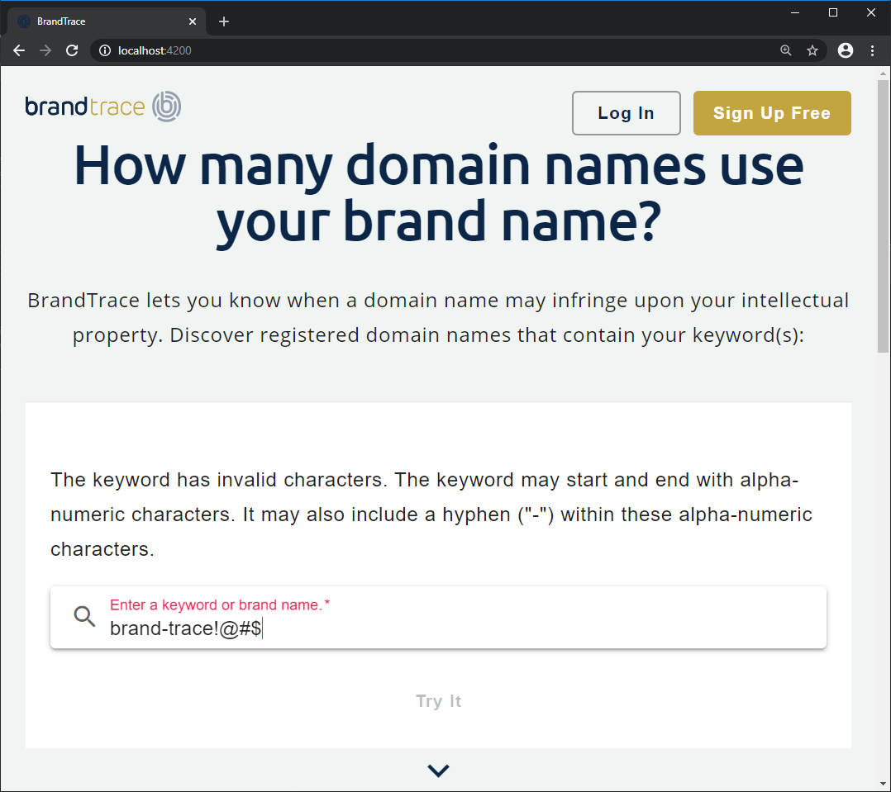

# Architecture Layers

- [Architecture Layers](#architecture-layers)
  - [Layer Definitions](#layer-definitions)
  - [UI (Presentation)](#ui-presentation)
    - [Search Form (Example)](#search-form-example)
    - [Search Form and Validation](#search-form-and-validation)
    - [Invalid Form and Notifications](#invalid-form-and-notifications)
  - [UI Service (Mediator)](#ui-service-mediator)
    - [UI Service (Example)](#ui-service-example)
    - [Motivation for UI Services](#motivation-for-ui-services)
  - [Core Domain Services](#core-domain-services)
    - [Domain Service Example (Search)](#domain-service-example-search)
      - [Search Service](#search-service)
  - [Domain Common Library](#domain-common-library)
    - [API Response Model](#api-response-model)
  - [Business Logic](#business-logic)
    - [Business Actions](#business-actions)
    - [Search Action](#search-action)
    - [Business Rules](#business-rules)
  - [Validation of a Single String Value (Example)](#validation-of-a-single-string-value-example)
    - [Business Rule (Shared)](#business-rule-shared)
  - [Data Repository](#data-repository)
    - [HTTP Error Handling](#http-error-handling)

## Layer Definitions

The following is a list of application layers (top-to-bottom) that represent the logical separation of concerns for each layer and their specific responsibilities.

- User interface and presentational concerns
  - what to show the user
  - how to display information
  - how to create, edit, or remove data/information
  - security: authentication and authorization

- UI Service
   
   - providing data to components
   - retrieve and persisting data using core domain services
   - managing state for UI/presentation concerns
   - abstracting the business logic from the presentational concerns
   - acts as a mediator between the UI and Core Domain Service
- Core Domain Services
  - provides an entry point or API to handle domain-business logic
  - has not UI or presentational concerns
  - encapsulates all business logic for the specified domain item
- Business Logic Layer
  -  encapsulated within a Core Domain Service
  -  provides a business logic layer for the specific domain
  -  a coordinating *BusinessProvider* service will provide the interface/API for business logic operations.
  -  all business logic operations will be implemented as units-of-work as business actions.
  -  business actions provide a consistent mechanism to validate input, evaluate business rules, and execute business logic
  -  return objects, if any, of business actions will be *Observables*
  -  all business rules will be implemented using a rule engine to provide a consistent and testable implementation of simple and complex business rules
  -  business actions will have access to specific members of the business provider (e.g., HTTP services, ServiceContext, etc.)
- Data Access
  - The application will implement specific data access providers to persist and retrieve data from data stores. 
  - All HTTP operations will use the HTTP service (cross-cutting concern library) to execute HTTP requests
  - All HTTP data providers will return a defined API Response object that contains the response payload and additional meta information required to handle the response - including providing messages to users and/or the application.

## UI (Presentation)

The UI layer will contain site-level presentational elements that are not related to a specific domain. These will mostly likely be organized in a *SiteModule* that is shared/exported to other feature-specific modules.

* Sidebar components for navigation
* Header
* Footer
* Menu components

The UI will also contain one or more feature modules that organize all of the items related to a feature within a single module. These modules will define their own routes - most likely including a default route that could be a target from the application-level lazy-loaded route(s). Feature modules provide a code organization strategy that enables encapsulation and a good separation of concerns.

* NgModule
* routes
* components (container and presentational)
* pipes
* directives
* services
* models

### Search Form (Example)

The following page/view is the home page for the new application. The home page view is a *container component* that contains a set of other *presentational* components to make up the display - like the *Keyword Search* form.

> **Container/Presentational Components**: Understanding the concept and principles are more important than a pure/strict adherence to this pattern. It is an organizational technique that is inline with a *reactive* programming flow. More information about container/presentation components:
> * [https://indepth.dev/container-components-with-angular/](https://indepth.dev/container-components-with-angular/)
> * [https://medium.com/@dan_abramov/smart-and-dumb-components-7ca2f9a7c7d0])https://medium.com/@dan_abramov/smart-and-dumb-components-7ca2f9a7c7d0


Most of the time *container components* are top-level entry point components that are the targets of the application routes. This is not a rule. Because depending on the structure of the view, there may be more than one container component responsible for coordinating the display using presentational components. 


*Presentational* components usually get data from their parent *container* component. These components take advantage of inputs and outputs to allow communication between the container and specified presentational component.


### Search Form and Validation

The search form is using Angular's Reactive Forms. We are using default validators and a custom *async* validator to check for any invalid characters. 

```ts
initializeForm() {
  this.loggingService.log(this.componentName, Severity.Information, `Preparing to initialize the keyword search form.`);
  this.keywordSearchForm = this.formBuilder.group({
    keyword: new FormControl(null, {
      validators: [Validators.required, Validators.minLength(3), Validators.maxLength(20)],
      asyncValidators: [this.invalidCharacterValidator],
    }),
  });
}
```

The `invalidCharacterValidator` implementation is simplified by using a [UI Service](#ui-service-mediator). The UI Service provides a location for component logic code that is shared by all components within the specified UI module. The UI Service can coordinate with other services to provide validation and data operations for the components. This abstraction should allow each component to have less code and be easier to test. 

```ts
  invalidCharacterValidator: AsyncValidatorFn = (control: FormControl): Observable<ValidationErrors | null> => {
    return this.uiService.validateKeyword(control);
  };
```  

### Invalid Form and Notifications

If there are any validation errors, the services provide enough information back to the components for user notification.



## UI Service (Mediator)

The *service* mentioned in the feature module above is the UI Service. In many applications, this service is overloaded with too many concerns and responsibilities. This service will be used to support UI concerns like state management and abstracting data access operations. This service will consume *core domain services* to perform data and business logic operations. It will have the responsibility to provide data to the components by way of Observables using one-way reactive streams of data. 

This means that components cannot directly communicate with Subject types (i.e., BehaviorSubject, ReplaySubject) to retrieve data streams. It is not the responsibility of components to subscribe to data streams - the UI service will abstract these operations by using the core domain services.

The *UI Service* will act as a mediator for the components to the core domain service. It will not perform or initiate any HTTP/API calls directly. In fact, using the layered-architecture approach there will no HTTP/API calls originating from the UI/Presentational layer. These will be implemented and encapsulated within the core domain service libraries.

### UI Service (Example)

This is a minimal example of *some* of the responsibilities that a UI Service could have. 

* coordinate async form validation(s)
* coordinate data retrieval and persistence with the domain service
* manage state for data elements displayed by the components

```ts
import { Injectable } from '@angular/core';
import { ServiceBase } from '@tc/foundation';
import { LoggingService } from '@tc/logging';
import { KeywordValidationService } from '../services/keyword-validation/keyword-validation.service';
import { FormControl } from '@angular/forms';
import { debounceTime, switchMap, map } from 'rxjs/operators';
import { of } from 'rxjs';

@Injectable({
  providedIn: 'root',
})
export class UISearchService extends ServiceBase {
  constructor(private keywordValidatorService: KeywordValidationService, loggingService: LoggingService) {
    super(loggingService, `UISearchServiceService`);
  }

  /**
  - Use to coordinate the validation of the [keyword] value for the UI.
  - @param control
   */
  validateKeyword(control: FormControl) {
    if (control.value == null) {
      return of(null);
    }
    return of(debounceTime(1200)).pipe(
      switchMap(() => {
        return this.keywordValidatorService.validateCharacters<boolean>(control.value).pipe(
          map(response => {
            return response.IsSuccess === true ? null : { invalidCharacters: true };
          })
        );
      })
    );
  }
}
```
### Motivation for UI Services

The implementation of the async validator returns the result a helper service (*KeywordValidatorService*). The UI Service provides more flexibility for the implementation details for the components. A component's main responsibility is to collect and display information within the designated view. Therefore, removing the *validation* logic outside of the component removes the responsibility to a more testable location and also reduces the responsibilities of the component. 

```ts
validateKeyword(control: FormControl) {
    if (control.value == null) {
      return of(null);
    }
    return of(debounceTime(1200)).pipe(
      switchMap(() => {
        return this.keywordValidatorService.validateCharacters<boolean>(control.value).pipe(
          map(response => {
            return response.IsSuccess === true ? null : { invalidCharacters: true };
          })
        );
      })
    );
  }
```

The testing of validation rules in a service is a smaller foot-print than performing all of the tests from component configurations.  

```ts
yarn test --test-file=keyword-validation.service.spec.ts --project=brand-trace --watch=true
yarn run v1.15.2
$ ng test --test-file=keyword-validation.service.spec.ts --project=brand-trace --watch=true
 PASS  apps/brand-trace/src/app/services/keyword-validation/keyword-validation.service.spec.ts
  KeywordValidationService
    √ should be created (21ms)
    √ should be valid with alpha-only value [brand] (10ms)
    √ should be valid with alpha-numeric value [brand1234] (4ms)
    √ should be valid with alpha-numeric value with space [brand 1234] (5ms)
    √ should be valid with numeric-only value [1234567890] (4ms)
    √ should be valid with alpha-numeric value with hyphen [brand-1234] (5ms)
    √ should be valid with alpha-only value with hyphen [brand-trace] (5ms)
    √ should be valid with numeric-only value with hyphen [1234-5678] (4ms)

Test Suites: 1 passed, 1 total
Tests:       8 passed, 8 total
Snapshots:   0 total
Time:        3.999s
Ran all test suites matching /keyword-validation.service.spec.ts/i.
```
The test setup and configuration is straight-forward and doesn't have any unnecessary *TestBed* configuration for:

* providers
* imports
* exports
* declarations

```ts
import { TestBed } from '@angular/core/testing';
import { ApiResponse } from '@tc/common';
import { KeywordValidationService } from './keyword-validation.service';
import { LoggingService } from '@tc/logging';

describe('KeywordValidationService', () => {
  beforeEach(() =>
    TestBed.configureTestingModule({
      providers: [LoggingService],
    })
  );

  it('should be created', () => {
    const service: KeywordValidationService = TestBed.get(KeywordValidationService);
    expect(service).toBeTruthy();
  });

  it('should be valid with alpha-only value [brand]', () => {
    const service: KeywordValidationService = TestBed.get(KeywordValidationService);

    const response = service.validateCharacters<boolean>('brand');
    let apiResponse: ApiResponse<boolean>;
    response.subscribe(
      result => {
        apiResponse = result;
      },
      error => console.log(error)
    );

    expect(apiResponse.IsSuccess).toEqual(true);
    expect(service.validateCharacters('')).toBeTruthy();
  });
});
```

## Core Domain Services

The core domain services are libraries that expose a service API for a specific domain item. A service within this library provides an accessible API to allow operations on the specified domain. There is a complete encapsulation of the business logic within this library. This library does not contain any items or operations related to UI or presentation concerns. It is a complete separation of business logic from the UI layer.

The core domain service will be provided (dependency injected) into any feature modules contained in the application project. Typically, the scope of this service will be at the feature module level. However, there could be use cases where the domain service is globally available from the application to any other feature module that may need to use its operations.


### Domain Service Example (Search)

The CLI command will create a new `search` library project in the `libs/brandtrace` folder. This project will contain the business logic for the *Search* feature of the BrandTrace application. 

```ts
ng generate library brandtrace/search --publishable --dry-run
? In which directory should the library be generated?
CREATE libs/brandtrace/search/ng-package.json (167 bytes)
CREATE libs/brandtrace/search/package.json (154 bytes)
CREATE libs/brandtrace/search/README.md (158 bytes)
CREATE libs/brandtrace/search/tsconfig.lib.json (519 bytes)
CREATE libs/brandtrace/search/tslint.json (188 bytes)
CREATE libs/brandtrace/search/src/index.ts (48 bytes)
CREATE libs/brandtrace/search/src/lib/brandtrace-search.module.ts (172 bytes)
CREATE libs/brandtrace/search/src/lib/brandtrace-search.module.spec.ts (400 bytes)
CREATE libs/brandtrace/search/tsconfig.json (126 bytes)
CREATE libs/brandtrace/search/tsconfig.spec.json (236 bytes)
CREATE libs/brandtrace/search/jest.config.js (278 bytes)
CREATE libs/brandtrace/search/src/test-setup.ts (30 bytes)
UPDATE package.json (8235 bytes)
UPDATE angular.json (41393 bytes)
UPDATE nx.json (1468 bytes)
UPDATE tsconfig.json (1696 bytes)
```

#### Search Service

This service is the interface or public API for the domain library. The responsibility of this service is to coordinate the request and response for the specified requests. 

> Note: This service is the *facade* of the Facade Pattern for this domain service. It encapsulates the actual implementation details of the business logic. There should be no *business logic* details or implementation within this service.

```ts
import { Injectable, Inject } from '@angular/core';
import { ServiceBase } from '@tc/foundation';
import { LoggingService } from '@tc/logging';
import { BusinessProviderService } from './business/business-provider.service';
import { Observable, of } from 'rxjs';
import { SearchResult } from '@tc/brandtrace/common';
import { ApiResponse } from '@tc/common';

@Injectable({
  providedIn: 'root',
})
export class SearchService extends ServiceBase {
  constructor(@Inject(BusinessProviderService) private businessProvider: BusinessProviderService, loggingService: LoggingService) {
    super(loggingService, 'SearchService');
    this.initializeBusinessProvider();
  }

  /**
  - Use to initialize the business provider. Required to use
  - the same [ServiceContext] throughout the stack.
   */
  private initializeBusinessProvider() {
    this.businessProvider.serviceContext = this.serviceContext;
  }

  search<T extends SearchResult[]>(keyword: string): Observable<ApiResponse<T>> {
    return this.businessProvider.search<T>(keyword);
  }
}
```

Add a service that will act as an entry point to the domain service.

```ts
ng g service search --flat=false --project=brandtrace-search
CREATE libs/brandtrace/search/src/lib/search/search.service.spec.ts (333 bytes)
CREATE libs/brandtrace/search/src/lib/search/search.service.ts (135 bytes)
```

## Domain Common Library

Create a library project for the specific application's *common* domain information.

* models and/or entities
* shared classes and enums
* shared rules
* regular expression constants

```ts
ng g library brandtrace/common --publishable
? In which directory should the library be generated?
CREATE libs/brandtrace/common/ng-package.json (167 bytes)
CREATE libs/brandtrace/common/package.json (154 bytes)
CREATE libs/brandtrace/common/README.md (158 bytes)
CREATE libs/brandtrace/common/tsconfig.lib.json (519 bytes)
CREATE libs/brandtrace/common/tslint.json (188 bytes)
CREATE libs/brandtrace/common/src/index.ts (48 bytes)
CREATE libs/brandtrace/common/src/lib/brandtrace-common.module.ts (172 bytes)
CREATE libs/brandtrace/common/src/lib/brandtrace-common.module.spec.ts (400 bytes)
CREATE libs/brandtrace/common/tsconfig.json (126 bytes)
CREATE libs/brandtrace/common/tsconfig.spec.json (236 bytes)
CREATE libs/brandtrace/common/jest.config.js (278 bytes)
CREATE libs/brandtrace/common/src/test-setup.ts (30 bytes)
UPDATE package.json (8235 bytes)
UPDATE angular.json (42590 bytes)
UPDATE nx.json (1519 bytes)
UPDATE tsconfig.json (1768 bytes)
```

### API Response Model

The following command creates a shared API response model for the *keyword search* request.

```ts
ng g class search/searchResult --skipTests --project=brandtrace-common
CREATE libs/brandtrace/common/src/lib/search/search-result.ts (30 bytes)
```

## Business Logic 

Create a new service within the domain library that will coordinate business logic for the domain service. 

```ts
ng g service business/businessProvider --project=brandtrace-search
CREATE libs/brandtrace/search/src/lib/business/business-provider.service.spec.ts (384 bytes)
CREATE libs/brandtrace/search/src/lib/business/business-provider.service.ts (145 bytes)
```

The business provider will initialize and execute business actions to process the request. 

```ts
import { Injectable, Inject } from '@angular/core';
import { BusinessProviderBase, ServiceBase } from '@tc/foundation';
import { LoggingService } from '@tc/logging';
import { HttpSearchRepositoryService } from './http-search-repository.service';
import { Observable, of } from 'rxjs';
import { SearchAction } from './actions/search.action';
import { SearchResult } from '@tc/brandtrace/common';
import { ApiResponse } from '@tc/common';

@Injectable({
  providedIn: 'root',
})
export class BusinessProviderService extends BusinessProviderBase implements IBusinessProviderService {
  constructor(@Inject(HttpSearchRepositoryService) public apiService: HttpSearchRepositoryService, loggingService: LoggingService) {
    super(loggingService);
  }

  search<T extends SearchResult[]>(keyword: string): Observable<ApiResponse<T>> {
    const action = new SearchAction<T>(keyword);
    action.Do(this);
    return action.response;
  }
}

export class BusinessProviderServiceMock extends ServiceBase implements IBusinessProviderService {
  constructor(@Inject(HttpSearchRepositoryService) public apiService: HttpSearchRepositoryService, loggingService: LoggingService) {
    super(loggingService, 'BusinessProviderServiceMock');
  }

  search<T extends SearchResult[]>(keyword: string): Observable<ApiResponse<any>> {
    const data = <T>new Array<SearchResult>();

    const apiResponse = new ApiResponse<T>();
    apiResponse.IsSuccess = true;
    apiResponse.Message = 'Successfully processed keyword search.';
    apiResponse.Data = data;

    return of(apiResponse);
  }
}

export interface IBusinessProviderService {
  search<T extends SearchResult[]>(keyword: string): Observable<ApiResponse<T>>;
}
```

### Business Actions

Business actions provide the *units of work* that execute and process business logic for the application. 

```ts
ng generate class business/actions/businessActionBase --skipTests --project=brandtrace-search
CREATE libs/brandtrace/search/src/lib/business/actions/business-action-base.ts (36 bytes)
```

Business actions use a base class to provide *context* to each of the actions. Basically, we are providing the *BusinessProvider* and *LoggingService* along with a shared ServiceContext that aggregates information from any other actions.

```ts
import { LoggingService } from '@tc/logging';
import { ActionBase } from '@tc/foundation';
import { Observable } from 'rxjs';
import { BusinessProviderService } from './../business-provider.service';
import { ApiResponse } from '@tc/common';

/**
 * A helper class to provide the action with required dependencies and
 * starting the execution of the action life-cycle pipeline.
 */
export abstract class BusinessActionBase<T> extends ActionBase {
  showRuleMessages = true;
  hideRuleMessages = false;

  businessProvider: BusinessProviderService;
  loggingService: LoggingService;
  actionName: string;
  public response: Observable<ApiResponse<T>>;

  constructor(actionName: string) {
    super();
    this.actionName = actionName;
  }

  /**
  - Use the [Do] method to perform the action. Also uses [inversion of control]
  - and provides the action the same instance of the [service context] and
  - [logging service].
   */
  Do(businessProvider: BusinessProviderService) {
    this.businessProvider = businessProvider;
    this.serviceContext = businessProvider.serviceContext;
    this.loggingService = businessProvider.loggingService;

    this.execute();
  }
}
```

### Search Action

Use the CLI to create a new action in the domain library. 

```ts
ng g class business/actions/search.action --skipTests=false --project=brandtrace-search
CREATE libs/brandtrace/search/src/lib/business/actions/search.action.spec.ts (182 bytes)
CREATE libs/brandtrace/search/src/lib/business/actions/search.action.ts (31 bytes)
```

The implementation includes setting up validation rules and executing the business logic in the `performAction()` method.

```ts
import { BusinessActionBase } from './business-action-base';
import { Severity } from '@tc/logging';
import { SearchResult } from '@tc/brandtrace/common';
import { KeywordIsValidRule } from '@tc/brandtrace/common';

/**
 * Action implements business logic of performing a keyword search.
 */
export class SearchAction<T extends SearchResult[]> extends BusinessActionBase<T> {
  constructor(private keyword: string) {
    super('SearchAction');
  }

  preValidateAction() {
    this.validationContext.addRule(
      new KeywordIsValidRule('KeywordIsValid', 'The keyword is not valid.', this.keyword, this.showRuleMessages)
    );
  }

  performAction() {
    this.loggingService.log(this.actionName, Severity.Information, `Preparing to execute a keyword search for [${this.keyword}].`);
    this.response = this.businessProvider.apiService.search<T>(this.keyword);
  }
}
```

### Business Rules

The rule-engine library project contains the framework and helper classes to execute validation and business rules. There is a pre-defined set of rules read to use. You can compose your validation logic using any of the rules.

## Validation of a Single String Value (Example)

The following example shows the implementation of an async validator using the *rule-engine* library. The validation of the a string value for the following cases:

* value is not null or undefined
* value length is within 3 and 20 characters
* string matches the specified regular expression

Use the *ValidationContext* as a container for the specified rules to evaluate. The `addRule()` method allows you to add any rule that *extends* a `RulePolicy`. The following rule-set is implemented inline within the method. However, the *rule-engine* allows you to create (2) types of rules that enable you to encapsulate the rule-set into a single rule.

1. Simple
2. Composite

```ts
validateCharacters<T>(value: any): Observable<ApiResponse<T>> {
    const validationContext = new ValidationContext();
    const expression: RegExp = /^[a-zA-Z0-9\-\s]*$/;
    validationContext.addRule(
      new StringIsNotNullEmptyRange(
        'KeywordStringIsValid',
        'The keyword value is not valid. Must be within 3 and 20 characters.',
        value,
        3,
        20,
        this.displayValidationMessages
      )
    );

    validationContext.addRule(
      new StringIsRegExMatch(
        'KeywordContainsValidCharacters',
        'The keyword contains invalid characters. The keyword may start and end with alpha-numeric characters; may include a hyphen ("-") within the alpha-numeric characters.',
        value,
        expression,
        this.displayValidationMessages
      )
    );

    validationContext.renderRules();

    this.loggingService.log(this.serviceName, Severity.Information, `Preparing to validate characters in the keyword: ${value}`);
    const response = new ApiResponse<T>();
    response.IsSuccess = validationContext.isValid;
    response.Message = validationContext.isValid ? 'The keyword is valid.' : 'The keyword is not valid.';
    if (!validationContext.isValid) {
      validationContext.results.map(result => {
        const message = new ApiMessage();
        message.isDisplayable = this.displayValidationMessages;
        message.message = result.message;
        message.messageType = ApiMessageType.Error;

        response.Messages.push(message);
      });
    }
    response.Timestamp = new Date();

    return of(response);
  }
  ```

  ### Business Rule (Shared)

  An alternative to adding rules to a `ValidationContext` is to create a shared rule. Add the rule to the barrel file (*index.ts*) for the library to expose it to other consumers that may need to use the rule.

```ts
import { CompositeRule, StringIsNotNullEmptyRange, StringIsRegExMatch } from '@tc/rule-engine';

export class KeywordIsValidRule extends CompositeRule {
  constructor(name: string, message: string, private keyword: string, isDisplayable: boolean = true) {
    super(name, message, isDisplayable);
    this.configureRules();
  }

  configureRules() {
    const expression: RegExp = /^[a-zA-Z0-9\-\s]*$/;
    this.rules.push(
      new StringIsNotNullEmptyRange(
        'KeywordStringIsValid',
        'The keyword value is not valid. Must be within 3 and 20 characters.',
        this.keyword,
        3,
        20,
        true
      )
    );

    this.rules.push(
      new StringIsRegExMatch(
        'KeywordContainsValidCharacters',
        'The keyword contains invalid characters. The keyword may start and end with alpha-numeric characters; may include a hyphen ("-") within the alpha-numeric characters.',
        this.keyword,
        expression,
        true
      )
    );
  }
}
```
  


## Data Repository

The application stack will contain a specific layer for HTTP calls to the application's API. 

```ts
ng g service business/httpSearchRepository --project=brandtrace-search
CREATE libs/brandtrace/search/src/lib/business/http-search-repository.service.spec.ts (405 bytes)
CREATE libs/brandtrace/search/src/lib/business/http-search-repository.service.ts (149 bytes)
```

The `HttpSearchRepositoryService` provides an implementation for making HTTP calls using the shared library `HttpService`. 

```ts
import { Injectable } from '@angular/core';
import { ServiceBase } from '@tc/foundation';
import { LoggingService, Severity } from '@tc/logging';
import { Observable, of } from 'rxjs';
import { ApiResponse } from '@tc/common';
import { KeywordSearchRequest, SearchResult, DomainItem } from '@tc/brandtrace/common';
import { HttpService, HttpRequestMethod } from '@tc/http-service';
import { Guid } from 'guid-typescript';

@Injectable({
  providedIn: 'root',
})
export class HttpSearchRepositoryService extends ServiceBase implements IHttpSearchRepositoryService {
  constructor(private httpService: HttpService, loggingService: LoggingService) {
    super(loggingService, 'HttpSearchRepositoryService');
  }

  // search<T extends SearchResult>(keyword: string): Observable<ApiResponse<T>> {
  search<T extends SearchResult>(searchRequest: KeywordSearchRequest): Observable<any> {
    const requestUrl = `http://brandtracewebapi.stgapi.tcdevops.com/Search`;
    this.loggingService.log(this.serviceName, Severity.Information, `Preparing to call keyword search API: ${searchRequest.searchTerm}`);

    const options = this.httpService.createOptions(
      HttpRequestMethod.post,
      this.httpService.createHeader(),
      requestUrl,
      searchRequest,
      false
    );

    return this.httpService.execute(options);
  }
}

export interface IHttpSearchRepositoryService {
  search<T extends SearchResult>(searchRequest: KeywordSearchRequest): Observable<ApiResponse<T>>;
}
```

### HTTP Error Handling

Notice that there is no error handling in the *repository* class for the HTTP calls. The `http-service` library contains an HTTP interceptor to catch any errors. This interceptor will determine the error type and process accordingly - with the intent of providing the consumer of the API a response that can be consumed with error details.

```ts
import { HttpInterceptor, HttpRequest, HttpHandler, HttpEvent, HttpErrorResponse } from '@angular/common/http';
import { Observable, throwError } from 'rxjs';
import { retry, catchError } from 'rxjs/operators';
import { ApiResponse, ApiErrorMessage } from '@tc/common';

export class HttpErrorInterceptor implements HttpInterceptor {
  displayToUser = true;
  doNotDisplayToUser: false;

  intercept(request: HttpRequest<any>, next: HttpHandler): Observable<HttpEvent<any>> {
    return next.handle(request).pipe(
      retry(1),
      catchError((error: any) => {
        return this.handleError(error);
      })
    );
  }

  protected handleError(error: HttpErrorResponse): Observable<any> {
    const apiErrorResponse = new ApiResponse();
    apiErrorResponse.isSuccess = false;

    // Use the base error object to determine if the error type is a general or an all-purpose error.
    if (error.error instanceof ErrorEvent) {
      // A client-side or network error occurred. Handle it accordingly.
      apiErrorResponse.messages.push(new ApiErrorMessage(`A client-side or network error occurred.`, null));
      return throwError(apiErrorResponse);
    } else {
      // The API returned an unsuccessful response (failure status code).
      if (error instanceof ApiResponse) {
        /**
        - A known error response format from the API/Server; rethrow this response.
         *
        - Throwing the error sends the Observable to the subscriber of the response.
        - The subscriber or consumer should handle the response and display of messages.
         */
        return throwError(error);
      } else {
        // An unhandled error/exception - may not want to display this information to an end-user.
        apiErrorResponse.messages.push(
          new ApiErrorMessage(`The API returned an unsuccessful response. ${error.status}: ${error.statusText}. ${error.message}`, null)
        );
        return throwError(apiErrorResponse);
      }
    }
  }
}
```