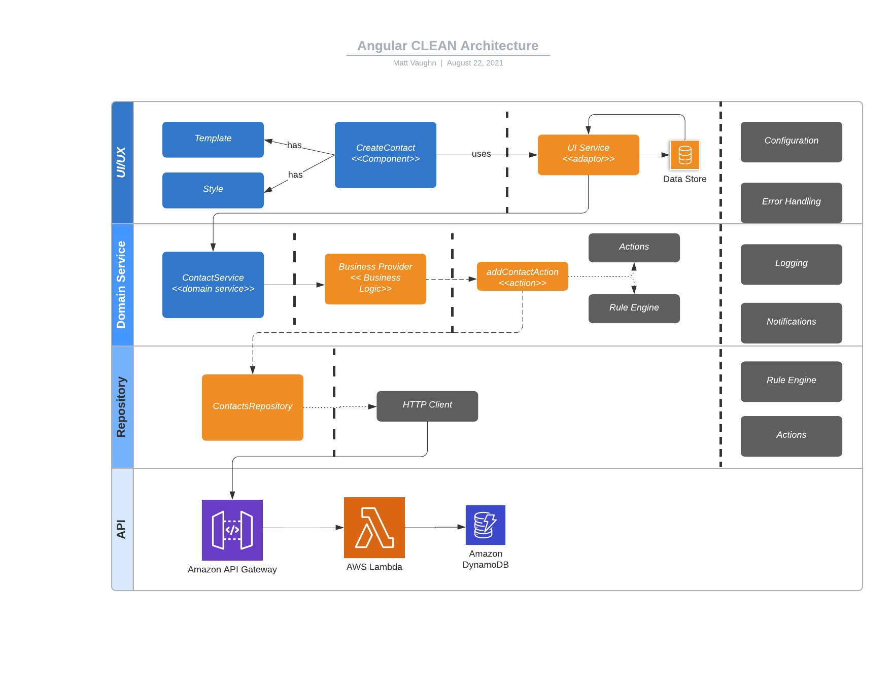

# Introduction

## Workshop

This workshop will be a single-day of development to create a fullstack application using Angular and NestJS along with Nx.dev tools.

## Goals/Objectives

Use a CLEAN architecture principles and approach to create a fullstack application.



- Create Nx Workspace
- Add Angular Application (Portal)
  - workspace configuration
  - Nx commands (lint, test, build, and serve)
- Add Template for Layout and Style
  - main layout
  - header and footer
  - navigation
- Add Cross-Cutting Concern Libraries
- Add Configuration to Portal Application
- Inject Cross-Cutting Libraries
- Add Schematics/Generators
- Add Contact Feature Library
  - Add Create Contact
  - View Contacts (List)
  - Edit Contact
  - Remove Contact
- Add Contact Domain Service Library
- Add API Project (NestJS)
- AWS
- Serverless

## Source Code

> Git Repository: [https://github.com/buildmotion/angular-clean-architecture-workshop](https://github.com/buildmotion/angular-clean-architecture-workshop)

### Workshop Repository

```ts
git clone https://github.com/buildmotion/angular-clean-architecture-workshop.git
```

Repository Branches

```ts
git checkout 1_setup/create-nx-workspace
git checkout 1_setup/add-angular-application
git checkout 2_setup/add-cross-cutting-libraries
git checkout 2_setup/add-code-to-x-concern-libs
git checkout 3_app/configure-application
git checkout 4_tools/generators-and-schematics
git checkout 5_accounts/create-ui-library
git checkout 5-2/accounts/add-new-account-form
git checkout 5-3/accounts/add-new-account-template
git checkout 5-4/accounts/new-accounts-ui-service
git checkout 6-1/accounts/domain-service
git checkout 6-2/accounts/handle-api-response
git checkout 7-1/accounts/add-api-project
git checkout 7-2/accounts/add-accounts-controller
git checkout 7-3/accounts/integrate-accounts-api
git checkout 7-4/accounts/api-debugging-tools
```