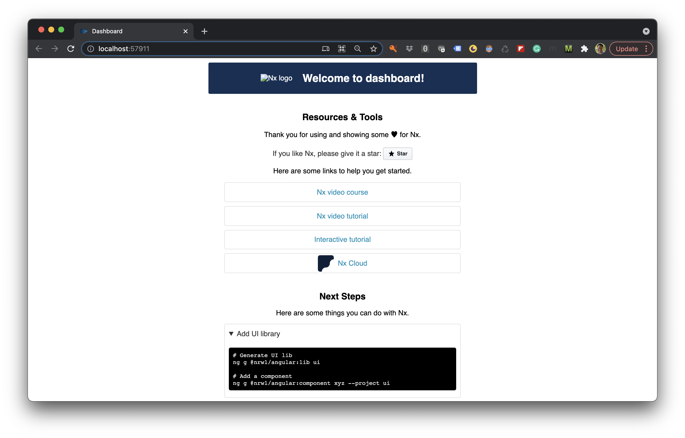
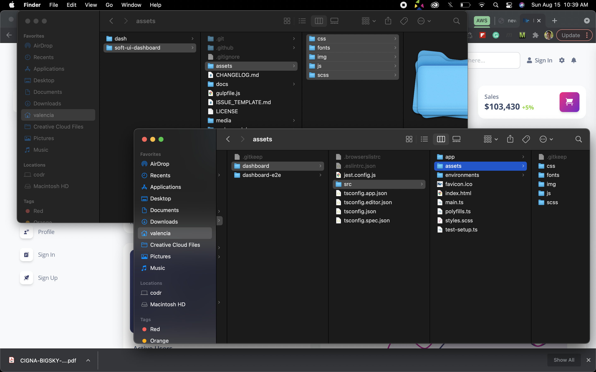

# Add New Angular Application

## Prerequisites

The Nx Workspace will require the `@nrwl/angular` package that contains the *generators* to create a new Angular application. 

```ts
yarn add @nrwl/angular@11.6.3 -D
```

## CLI Command

> The Nx CLI Is a tool that contains a set of generators. Each generator or schematic contains templates that generate code, applications, services, or other things in the workspace. Use the generators to quickly scaffold your application and libraries for the workspace.

Use the following command to create a new application project in your workspace.

 - The application name is *black-dashboard*.

```ts
nx generate @nrwl/angular:application black-dashboard
```

The output of the application generate command.

```ts
CREATE jest.config.js
CREATE jest.preset.js
CREATE apps/black-dashboard/tsconfig.editor.json
CREATE apps/black-dashboard/tsconfig.json
CREATE apps/black-dashboard/src/favicon.ico
CREATE apps/black-dashboard/.browserslistrc
CREATE apps/black-dashboard/tsconfig.app.json
CREATE apps/black-dashboard/src/index.html
CREATE apps/black-dashboard/src/main.ts
CREATE apps/black-dashboard/src/polyfills.ts
CREATE apps/black-dashboard/src/styles.scss
CREATE apps/black-dashboard/src/assets/.gitkeep
CREATE apps/black-dashboard/src/environments/environment.prod.ts
CREATE apps/black-dashboard/src/environments/environment.ts
CREATE apps/black-dashboard/src/app/app.module.ts
CREATE apps/black-dashboard/src/app/app.component.scss
CREATE apps/black-dashboard/src/app/app.component.html
CREATE apps/black-dashboard/src/app/app.component.spec.ts
CREATE apps/black-dashboard/src/app/app.component.ts
CREATE .eslintrc.json
CREATE apps/black-dashboard/.eslintrc.json
CREATE apps/black-dashboard/jest.config.js
CREATE apps/black-dashboard/src/test-setup.ts
CREATE apps/black-dashboard/tsconfig.spec.json
CREATE apps/black-dashboard-e2e/cypress.json
CREATE apps/black-dashboard-e2e/src/fixtures/example.json
CREATE apps/black-dashboard-e2e/src/integration/app.spec.ts
CREATE apps/black-dashboard-e2e/src/plugins/index.js
CREATE apps/black-dashboard-e2e/src/support/app.po.ts
CREATE apps/black-dashboard-e2e/src/support/commands.ts
CREATE apps/black-dashboard-e2e/src/support/index.ts
CREATE apps/black-dashboard-e2e/tsconfig.e2e.json
CREATE apps/black-dashboard-e2e/tsconfig.json
CREATE apps/black-dashboard-e2e/.eslintrc.json
UPDATE workspace.json
UPDATE package.json
UPDATE .vscode/extensions.json
UPDATE nx.json
```

### Available Options

Each *template* has a specific set of options that can be applied when you run the command.

```ts
nx generate @nrwl/angular:application black-dashboard --help
```

| Option      | Description      |
|  ---  |  ---  |
  |--name                  |The name of the application.|
  |--directory             |The directory of the new application.|
  |--style                 |The file extension to be used for style files. (default: css)|
  |--routing               |Generates a routing module.|
  |--inlineStyle           |Specifies if the style will be in the ts file.|
  |--inlineTemplate        |Specifies if the template will be in the ts file.|
  |--viewEncapsulation     |Specifies the view encapsulation strategy.|
  |--enableIvy             |Create a new app that uses the Ivy rendering engine. (default: true)|
  |--prefix                |The prefix to apply to generated selectors.|
  |--skipTests             |Skip creating spec files.|
  |--skipFormat            |Skip formatting files|
  |--skipPackageJson       |Do not add dependencies to package.json.|
  |--unitTestRunner        |Test runner to use for unit tests (default: jest)|
  |--e2eTestRunner         |Test runner to use for end to end (e2e) tests (default: cypress)|
  |--tags                  |Add tags to the application (used for linting)|
  |--linter                |The tool to use for running lint checks. (default: eslint)|
  |--backendProject        |Backend project that provides data to this application. This sets up |proxy.config.json.|
  |--strict                |Creates an application with stricter type checking and build optimization |options.|
  |--dryRun                |Runs through and reports activity without writing to disk.|
  |--skip-nx-cache         |Skip the use of Nx cache.|
  |--help                  |Show available options for project target.|

### Serve the New Application 

> nx serve dashboard



## Angular Template

 This workshop will take advantage of a template to provide the styles and layout for our application.

- demo: [Dashboard Template](https://demos.creative-tim.com/soft-ui-dashboard-pro/pages/dashboards/default.html?_ga=2.216831702.1978166807.1628202168-1527944961.1625616027)
- template: [Template](https://www.creative-tim.com/product/soft-ui-dashboard)
- Github.com: [https://github.com/creativetimofficial/soft-ui-dashboard](https://github.com/creativetimofficial/soft-ui-dashboard)



## Template Setup

The original template contains several layout options and widgets.

<!-- FIXME: ADD TEMPLATE IMAGE HERE -->

 The workshop template will be updated to just contain a layout and a few component elements.

 - header
 - footer
 - left navigation

<!-- FIXME: ADD IMAGE OF LAYOUT -->

### Styles

```json
{
  "glob": "**/*",
  "input": "libs/shared/assets/src/assets",
  "output": "assets"
},
```

### Update JavaScript References

```ts
yarn add @popperjs/core@2.9.2
```