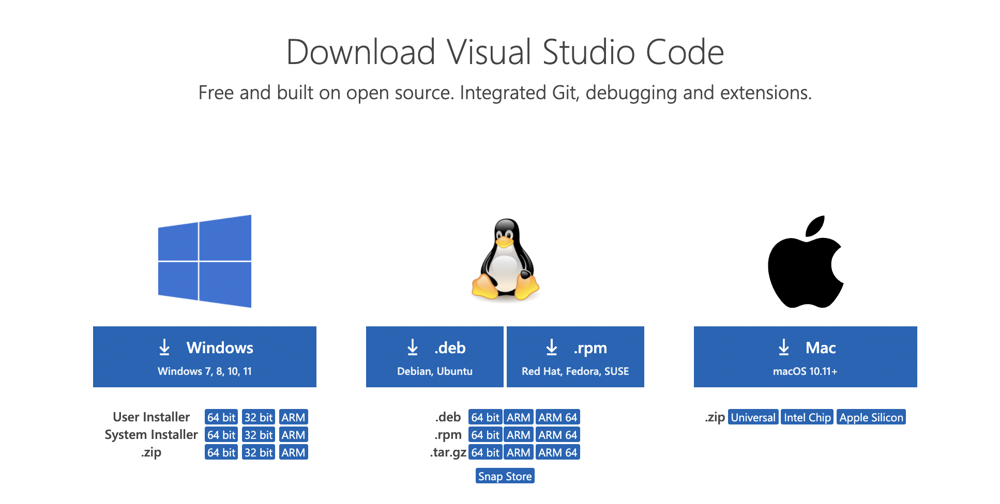
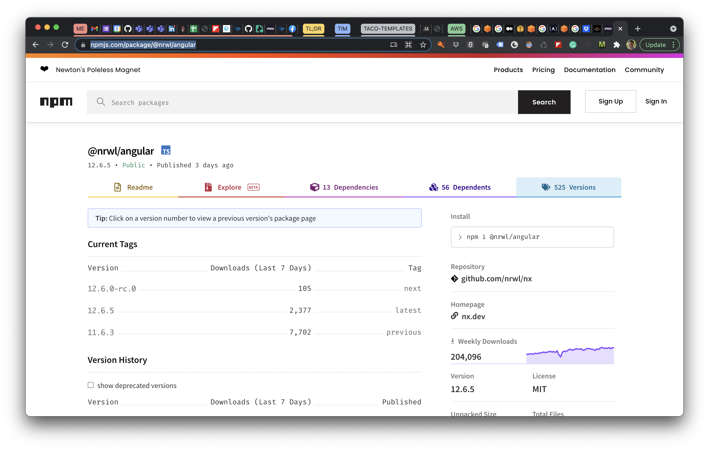

# Setup

## Prerequisites

- Visual Studio Code
- Node Version Manager (nvm)
- Git
- AWS Account

### Visual Studio Code

Download and install the latest version of Visual Studio Code at [https://code.visualstudio.com/download](https://code.visualstudio.com/download).

{width: 69%}


### Node

You will need to install Node version `14.17.4` on your machine. There are different ways to do this. I recommend using Node Version Manager (nvm). 

### Node Version Manager (nvm)

Install Node Version Manager (nvm) on you machine. This will allow you to target specific versions of Node and to change them without requiring a complete removal and install of Node.

- Mac OS installation: [https://tecadmin.net/install-nvm-macos-with-homebrew/](https://tecadmin.net/install-nvm-macos-with-homebrew/) for instructions.
- Max Big Sur installation: [https://andrejacobs.org/macos/installing-node-js-on-macos-big-sur-using-nvm/](https://andrejacobs.org/macos/installing-node-js-on-macos-big-sur-using-nvm/)
- Windows installation: [https://dev.to/skaytech/how-to-install-node-version-manager-nvm-for-windows-10-4nbi](https://dev.to/skaytech/how-to-install-node-version-manager-nvm-for-windows-10-4nbi)

```ts
# install nvm
nvm use 14.17.4
node -v > .nvmrc
node -v #verify version
```


> After installing nmv, use the `nvm install 14.17.4` command to install and use this specific version.

Use the `node -v` command on your terminal to verify Node exists and the version


### Git

Use the `git --version` on your terminal to verify Git exists and the version.

```ts
git version 2.30.1 (Apple Git-130)
```

### AWS Account

Create a new free tier account or use your existing AWS account.

> See: [AWS Free Tier - Create a free account](https://aws.amazon.com/free/?all-free-tier.sort-by=item.additionalFields.SortRank&all-free-tier.sort-order=asc&awsf.Free%20Tier%20Types=*all&awsf.Free%20Tier%20Categories=*all)

## Create New Workspace

 Using the Nx CLI to create a new workspace will create the workspace using the latest version of the Nrwl package. To target a specific package version you want to go to [npmjs.com](npmjs.com) to determine the specific version number you want to use.

> https://www.npmjs.com/package/@nrwl/angular

{width: 69%}


We will target version 11 for our new workspace. We want to use the latest minor/patch release of this major version 11 (e.g., 11.6.3). Use the *npx* command to create an empty workspace for our projects. Now we can add the version number to our `npx` command to specify the version we want.

```ts
npx create-nx-workspace@11.6.3 workspace --npm-scope=buildmotion
```

> Use the `--npm-scope` to create a scope that identify your organization and/or the package group (e.g., @angular/core, @angular/common, @angular/forms).

The output of the CLI command should look similar to the output listed below.

```ts
npx create-nx-workspace@11.6.3 workspace --npm-scope=buildmotion
npx: installed 66 in 2.68s
? What to create in the new workspace empty             [an empty workspace with a layout that works best for building apps]
? Use Nx Cloud? (It's free and doesn't require registration.) No

>  NX  Nx is creating your workspace.

  To make sure the command works reliably in all environments, and that the preset is applied correctly,
  Nx will run "npm install" several times. Please wait.


>  NX   SUCCESS  Nx has successfully created the workspace.
```

## Nx Workspace Structure

- multi-project environment
- shared package.json
- shared/inherited configurations
- tools
  - specification tests
  - E2# tests
- Nx CLI

### package.json

```json
{
  "name": "workspace",
  "version": "0.0.0",
  "license": "MIT",
  "scripts": {
    "nx": "nx",
    "start": "nx serve",
    "build": "nx build",
    "test": "nx test",
    "lint": "nx workspace-lint && nx lint",
    "e2e": "nx e2e",
    "affected:apps": "nx affected:apps",
    "affected:libs": "nx affected:libs",
    "affected:build": "nx affected:build",
    "affected:e2e": "nx affected:e2e",
    "affected:test": "nx affected:test",
    "affected:lint": "nx affected:lint",
    "affected:dep-graph": "nx affected:dep-graph",
    "affected": "nx affected",
    "format": "nx format:write",
    "format:write": "nx format:write",
    "format:check": "nx format:check",
    "update": "nx migrate latest",
    "workspace-generator": "nx workspace-generator",
    "dep-graph": "nx dep-graph",
    "help": "nx help"
  },
  "private": true,
  "dependencies": {
    "tslib": "^2.0.0"
  },
  "devDependencies": {
    "@nrwl/tao": "11.6.3",
    "@nrwl/cli": "11.6.3",
    "@nrwl/workspace": "11.6.3",
    "@types/node": "14.14.33",
    "dotenv": "8.2.0",
    "ts-node": "~9.1.1",
    "typescript": "~4.0.3",
    "prettier": "2.2.1"
  }
}
```

### workspace.json

```json
{
  "version": 2,
  "projects": {},
  "cli": {
    "defaultCollection": "@nrwl/workspace"
  }
}
```

### TypeScript Configuration

```json
// workspace/tsconfig.base.json (b16f50f)
{
  "compileOnSave": false,
  "compilerOptions": {
    "rootDir": ".",
    "sourceMap": true,
    "declaration": false,
    "moduleResolution": "node",
    "emitDecoratorMetadata": true,
    "experimentalDecorators": true,
    "importHelpers": true,
    "target": "es2015",
    "module": "esnext",
    "lib": ["es2017", "dom"],
    "skipLibCheck": true,
    "skipDefaultLibCheck": true,
    "baseUrl": ".",
    "paths": {}
  },
  "exclude": ["node_modules", "tmp"]
}
```

### nx.json

```json
// nx.json
{
  "npmScope": "buildmotion",
  "affected": {
    "defaultBase": "master"
  },
  "implicitDependencies": {
    "workspace.json": "*",
    "package.json": {
      "dependencies": "*",
      "devDependencies": "*"
    },
    "tsconfig.base.json": "*",
    "tslint.json": "*",
    ".eslintrc.json": "*",
    "nx.json": "*"
  },
  "tasksRunnerOptions": {
    "default": {
      "runner": "@nrwl/workspace/tasks-runners/default",
      "options": {
        "cacheableOperations": [
          "build",
          "lint",
          "test",
          "e2e"
        ]
      }
    }
  },
  "projects": {}
}
```

### .prettierrc

```json
// .prettierrc
{
  "singleQuote": true
}
```
