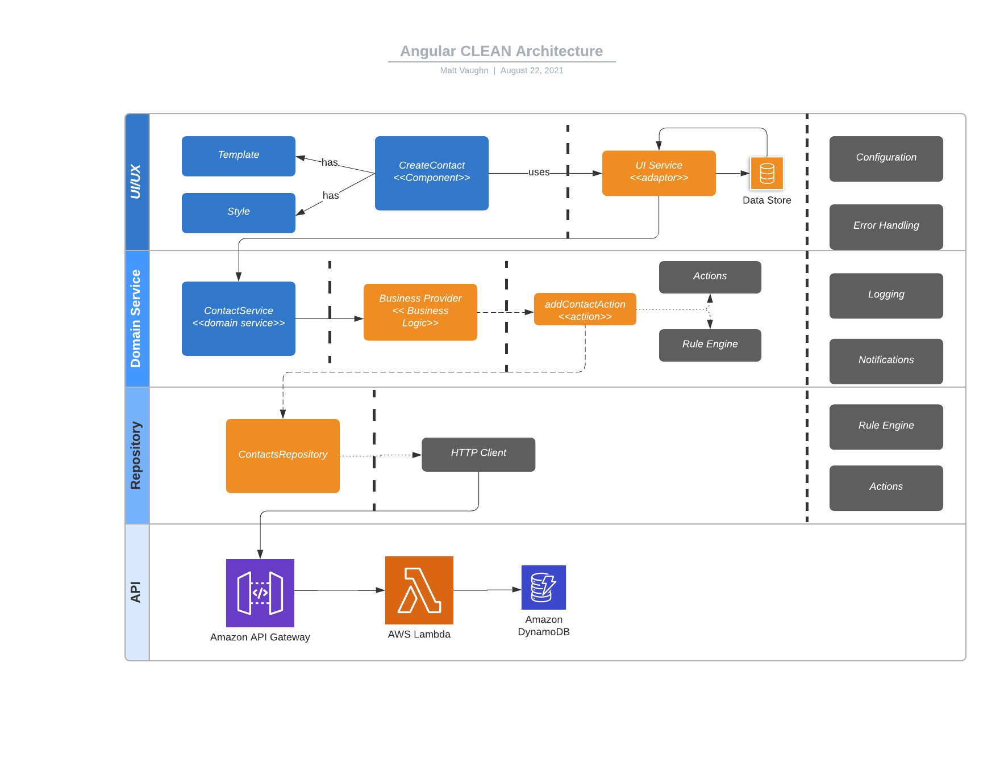

# Introduction

## Workshop

This workshop will be a single-day of development to create a fullstack application using Angular and NestJS along with Nx.dev tools.

## Goals/Objectives

Use a CLEAN architecture principles and approach to create a fullstack application.

- Create Nx Workspace
- Add Angular Application (Portal)
  - workspace configuration
  - Nx commands (lint, test, build, and serve)
- Add Template for Layout and Style
  - main layout
  - header and footer
  - navigation
- Add Cross-Cutting Concern Libraries
- Add Configuration to Portal Application
- Inject Cross-Cutting Libraries
- Add Schematics/Generators
- Add Contact Feature Library
  - Add Create Contact
  - View Contacts (List)
  - Edit Contact
  - Remove Contact
- Add Contact Domain Service Library
- Add API Project (NestJS)
- AWS
- Serverless
- AWS SDK
- Deploy Web Application (SPA)
- Deploy Lambda Function

## Source Code

> Git Repository: [https://github.com/buildmotion/angular-clean-architecture-workshop](https://github.com/buildmotion/angular-clean-architecture-workshop)